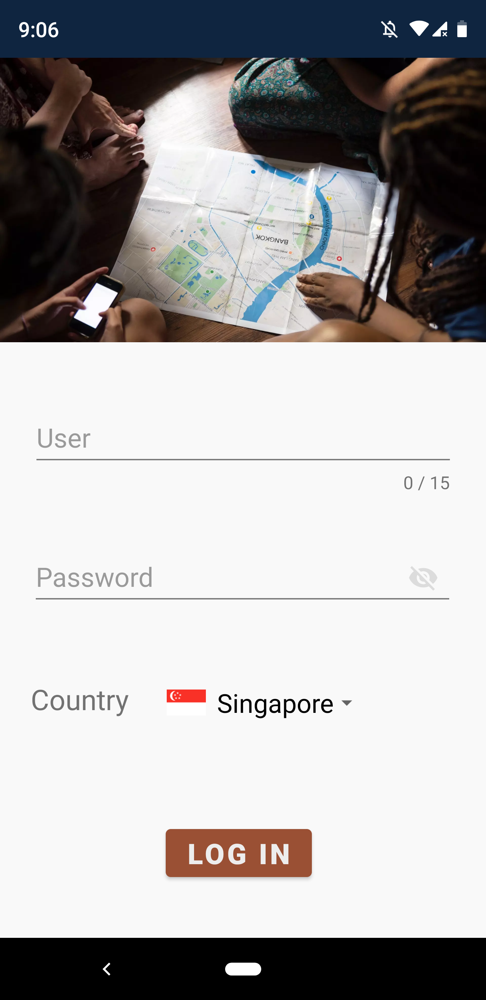
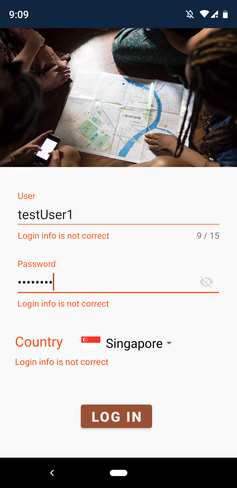
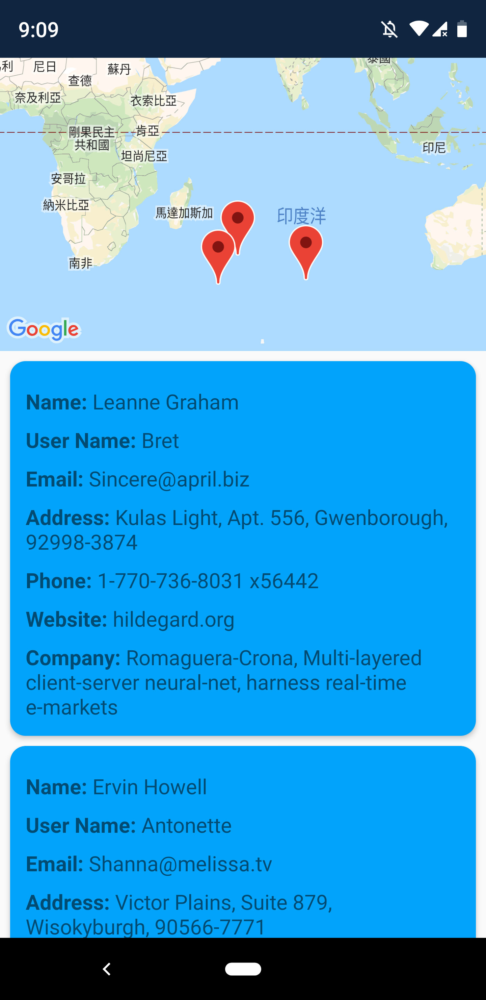
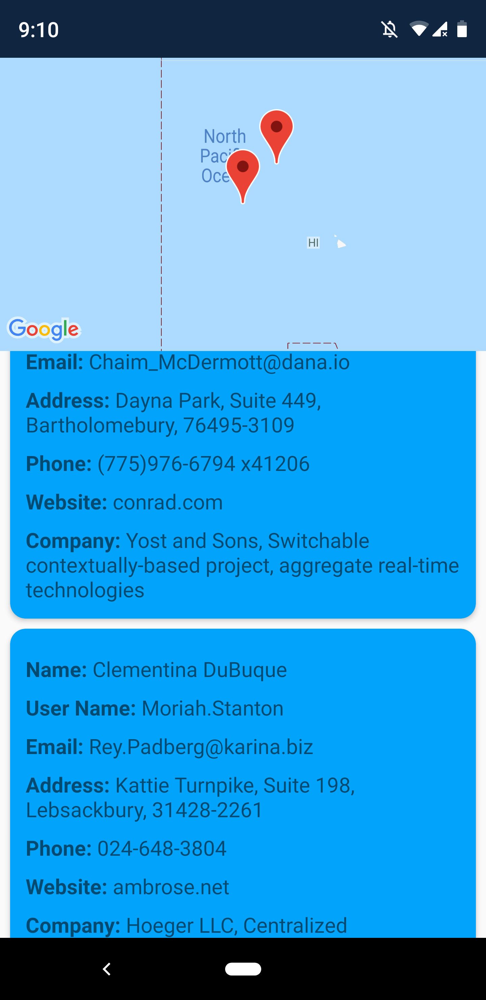

# coding_challenge

1.Login Page
-
* Login UI by material design component 

* Error hint for the invalid login 

2.Detail Page
-
* Detail page with the user list and the related map 

* Locate user location on the map by clicking the user's item 
